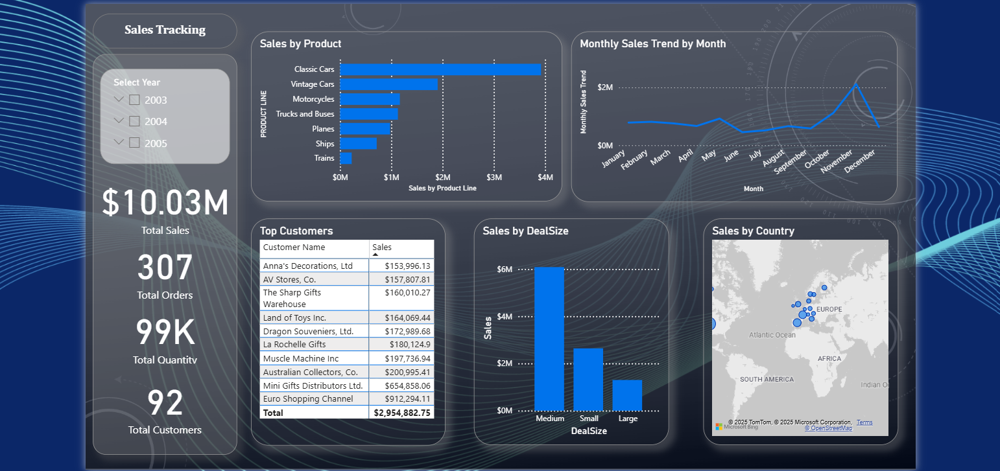

# 📊 Sales Dashboard Project (Excel + Power BI)

  
  

---

## 📌 Project Overview
This project demonstrates an **end-to-end sales analysis** using **Excel** for data cleaning and pivot analysis, and **Power BI** for interactive dashboarding.

The dashboard helps analyze **sales trends, customer behavior, product performance, and regional sales**.

---

## 📂 Project Structure

Sales_Dashboard_Project/
│
├── Data/
│ └── SalesData.xlsx
│
├── PowerBI/
│ └── Sales_Dashboard.pbix
│
├── Screenshots/
│ └── Dashboard_View.png
│
└── README.md

---

## ⚙️ Tools & Skills
- **Excel** → Data Cleaning, Pivot Tables, Exploratory Analysis  
- **Power BI** → Data Modeling, Interactive Visuals, Slicers, KPI Cards  
- **Visualization Skills** → Sales trends, product line performance, top customers  

---

## 📊 Dashboard Features
- ✅ **KPI Cards:** Total Sales, Total Orders, Total Quantity, Total Customers  
- ✅ **Line Chart:** Monthly sales trend  
- ✅ **Bar Chart:** Product line performance  
- ✅ **Map:** Sales by country  
- ✅ **Column Chart:** Deal size analysis  
- ✅ **Table:** Top 10 customers  
- ✅ **Slicers:** Year, Product Line, Country, Status  

---

## 📸 Screenshots

---

## 🔑 Key Insights
- Top customers drive a significant percentage of sales  
- Certain product lines consistently outperform others  
- Regional differences highlight growth opportunities  
- Deal size segmentation helps track business volume  

---

## 🚀 How to Use
1. Open `SalesData.xlsx` to explore raw & cleaned data.  
2. Open `Sales_Dashboard.pbix` in **Power BI Desktop**.  
3. Interact with slicers (Year, Product Line, Country, Status).  

---

## ✍️ Author
**Harshana Suraweera**  
[LinkedIn](https://www.linkedin.com/) | [GitHub](https://github.com/)  
